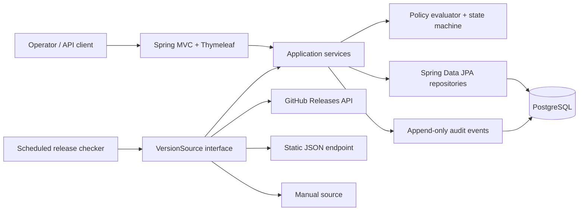
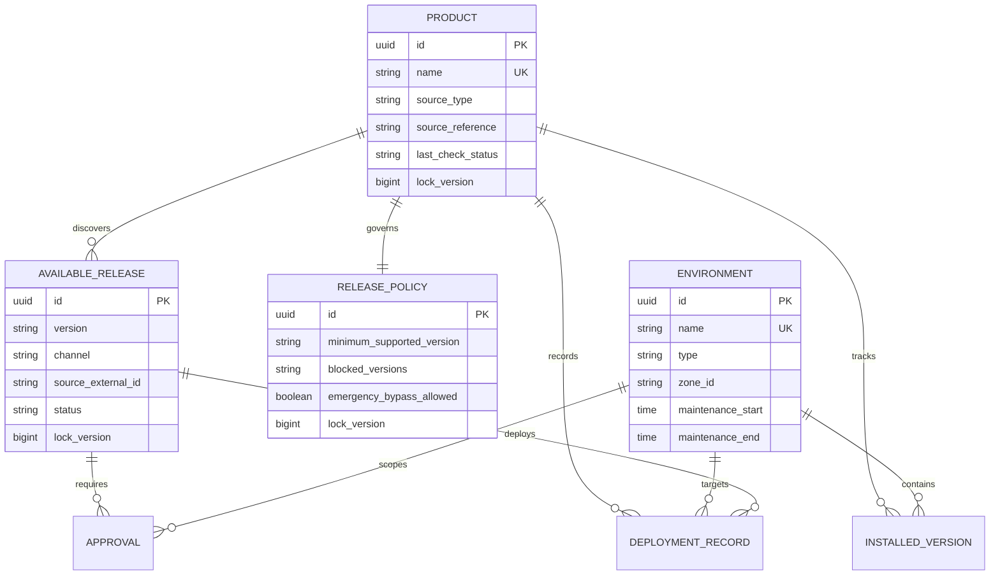
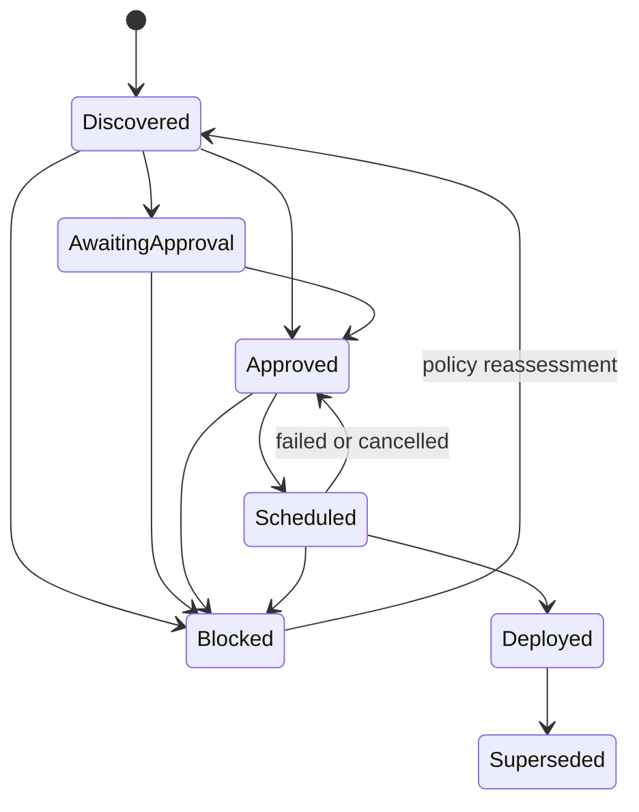

# Software Release Governance

[](https://github.com/German4341374/software-release-governance/actions/workflows/ci.yml)
[](LICENSE)

Software Release Governance is a compact release-control service for teams that operate software across development, staging, and production. It discovers available releases, compares semantic versions, evaluates deployment policy, records approval evidence, and preserves an append-only audit trail.

The project deliberately stops at governance: it records a deployment decision and its reported result, but it does not execute changes on target machines.

## Features

- Product catalog with GitHub Releases, static JSON, and manual version sources
- SemVer 2.0 comparison and stable, beta, and prerelease channels
- Development, staging, and production environments with time-zone-aware maintenance windows
- Idempotent release import using source identity and version/channel constraints
- Production approval, blocked-version, minimum-version, prerelease, and emergency policies
- Explicit release state machine and deployment history
- Outdated-environment dashboard, REST API, and responsive Thymeleaf interface
- Optimistic locking on mutable governance records
- Rate-limit-aware source checks with bounded timeout, retry, backoff, and jitter
- Scheduled refreshes that retain last-known-good data when a source is unavailable
- Flyway migrations, deterministic demonstration data, structured logs, and health endpoints
- Unit tests plus PostgreSQL integration tests powered by Testcontainers

## Architecture



The remote HTTP call never holds a database transaction. A successful response is normalized into candidates, then a short transaction applies uniqueness checks, imports releases, updates source status, and appends audit evidence. See [Architecture and decisions](docs/architecture.md).

## Data model



## Release lifecycle



Application code validates each transition; database checks constrain stored enum values. A production deployment also passes the policy evaluator before it reaches `Scheduled`.

## Technology stack

- Java 25 LTS and Maven 3.9.16 wrapper
- Spring Boot 4.1, Spring MVC, Spring Data JPA, Thymeleaf, Actuator
- PostgreSQL 18.4 and Flyway
- JUnit 5, AssertJ, and Testcontainers 2
- Docker Compose and GitHub Actions

Important build and container versions are pinned. Dependabot proposes controlled updates.

## Quick start with Docker

Prerequisites: Docker Engine with Compose v2 and Git. This works from Linux or Windows through WSL2 with Docker Desktop integration.

```bash
git clone https://github.com/German4341374/software-release-governance.git
cd software-release-governance
cp .env.example .env
# Replace POSTGRES_PASSWORD in .env with a local random value.
docker compose up --build --detach --wait
```

Open <http://localhost:8080>. The Flyway seed contains one fictional product, three environments, four releases, an approval, a policy, and deployment history.

Stop the stack without deleting data:

```bash
docker compose down
```

Delete the local database as well:

```bash
docker compose down --volumes
```

## Local Java development

Prerequisites: Java 25, Docker for integration tests, and PostgreSQL 18 if the application itself is run outside Compose. Maven does not need to be installed.

```bash
cp .env.example .env
./mvnw test
DATABASE_URL=jdbc:postgresql://localhost:5432/release_governance \
DATABASE_USERNAME=governance \
DATABASE_PASSWORD='your-local-password' \
./mvnw spring-boot:run
```

On PowerShell, set the three variables with `$env:NAME='value'` before running `./mvnw.cmd spring-boot:run`.

## Version sources

| Source | `sourceReference` | Contract |
|---|---|---|
| GitHub Releases | `owner/repository` | Up to 50 non-draft releases; tags must be valid semantic versions |
| Static JSON | HTTPS URL | Object containing a `releases` array as shown below |
| Manual | Empty | Releases are added through the UI or API |

```json
{
  "releases": [
    {
      "id": "portal-2.4.0",
      "version": "2.4.0",
      "channel": "STABLE",
      "prerelease": false,
      "publishedAt": "2026-08-01T10:00:00Z",
      "url": "https://releases.example.invalid/portal/2.4.0",
      "notes": "Example release metadata"
    }
  ]
}
```

`GITHUB_TOKEN` is optional for public repositories and increases the GitHub API rate allowance. The value is sent only to the configured GitHub API origin and is never logged or persisted. Plain HTTP and private, loopback, or link-local destinations are rejected outside the test profile.

## REST API examples

Health:

```bash
curl --fail http://localhost:8080/health
```

Register a GitHub-sourced product:

```bash
curl --fail-with-body -X POST http://localhost:8080/api/products \
  -H 'Content-Type: application/json' \
  -H 'X-Actor: release-manager' \
  -d '{"name":"Demo CLI","vendor":"Example Systems","description":"Fictional product","sourceType":"GITHUB_RELEASES","sourceReference":"octocat/Hello-World","defaultChannel":"STABLE"}'
```

Import a manual release into the seeded product:

```bash
curl --fail-with-body -X POST \
  http://localhost:8080/api/products/10000000-0000-0000-0000-000000000001/releases \
  -H 'Content-Type: application/json' \
  -H 'X-Actor: release-manager' \
  -d '{"version":"1.5.0","channel":"STABLE","externalId":"manual:1.5.0","notes":"Approved demonstration candidate"}'
```

Inspect governance state:

```bash
curl --fail http://localhost:8080/api/dashboard
curl --fail http://localhost:8080/api/approvals
curl --fail http://localhost:8080/api/deployments
```

The complete route catalog and request bodies are in [API reference](docs/api.md). Errors use RFC 9457 Problem Details and include safe machine-readable policy codes.

## Policy examples

The seed demonstrates all requested controls:

- prerelease versions are forbidden in production;
- production requires an approved, environment-scoped approval;
- `1.2.0` is the minimum supported target version;
- exact `1.3.4` and wildcard `2.0.*` versions are blocked;
- production deployments must fall inside the configured maintenance window;
- an emergency rollout can explicitly bypass approval and time-window checks, but never a blocked version, prerelease ban, or minimum-version rule.

Every emergency bypass and decision is present in deployment history and the audit log.

## Verification

```bash
./mvnw test        # unit tests; Testcontainers tests run when Docker is available
./mvnw verify      # tests, package, and JaCoCo report
docker compose config
docker compose build
docker compose up --detach --wait
curl --fail http://localhost:8080/health
```

CI runs `verify` on a Linux runner with Docker, uploads JUnit/JaCoCo artifacts, and builds the production image without publishing it. No workflow has package-write or deployment permissions.

## Security decisions

- Containers run as UID/GID 10001 with all Linux capabilities dropped, a read-only filesystem, and `no-new-privileges`.
- PostgreSQL is not published to the host; credentials come from environment variables and `.env` is ignored.
- Source fetches require HTTPS and reject destinations that resolve to private, loopback, or link-local addresses.
- External calls have strict timeouts and bounded retries; authentication headers are never logged.
- JPA uses optimistic locking; unique partial indexes prevent multiple pending approvals and active deployments.
- The database rejects updates and deletes to the audit table.
- This portfolio application intentionally has no login system. Do not expose it to untrusted networks without an identity-aware reverse proxy and authorization layer.

See [SECURITY.md](SECURITY.md) for reporting and production-hardening guidance.

## Troubleshooting

- `POSTGRES_PASSWORD is required`: copy `.env.example` to `.env` and replace the placeholder.
- Application remains unhealthy: run `docker compose logs application database`; confirm the database health check completed and port 8080 is free.
- Source shows `RATE_LIMITED`: wait until `nextCheckAfter`, add an optional GitHub token, or use manual import. Last-known releases remain available.
- Policy rejects a deployment: inspect the Problem Details `code`, current approval, maintenance window, and installed version. Do not bypass by editing the database.
- Testcontainers tests are skipped locally: start a Docker-compatible daemon and rerun `./mvnw verify`.
- Flyway validation fails: never edit an applied migration; add a new versioned migration.

Operational diagnosis is detailed in [Source outage runbook](docs/runbooks/source-outage.md).

## Limitations and future improvements

- No authentication or authorization; actor names are evidence labels, not verified identities.
- Deployment is simulated/recorded, not executed against infrastructure.
- Release notes are stored as plain text and the GitHub adapter reads the first 50 releases only.
- Policies are per product rather than inherited from organization or team scopes.
- A single application instance performs scheduled checks; multi-instance scheduling would require distributed locking.
- Future work: OIDC authentication, RBAC, signed release attestations, webhook ingestion, policy-as-code bundles, cursor-based GitHub pagination, OpenTelemetry traces, and deployment-provider plugins.

## Repository guide

- `src/main/java/.../adapter` — source adapter contract and resilient HTTP client
- `src/main/java/.../policy` — SemVer and deterministic policy evaluation
- `src/main/java/.../service` — transaction-aware application workflows
- `src/main/resources/db/migration` — schema, constraints, indexes, and fictional seed
- `src/test` — fast unit tests and real PostgreSQL integration tests
- `docs` — architecture, API, and operational runbooks

See [DEMO.md](DEMO.md) for a five-minute portfolio walkthrough and [CONTRIBUTING.md](CONTRIBUTING.md) for the Conventional Commits workflow.

## License

MIT License. See [LICENSE](LICENSE).
